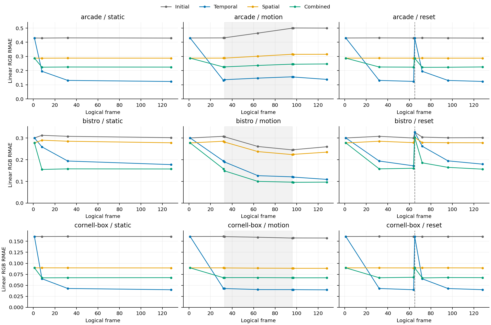

# ReSTIR DI baseline evaluation

## Experimental design

Controlled ablation of initial sampling, temporal reuse, spatial reuse, and combined reuse: 36 runs, baseline seed(s) 1. Camera paths, candidate budgets, lighting and materials are matched across modes; denoising and AA are disabled.

Settings: 1920 x 1080; local/environment/distant candidates 24/8/1; 4 spatial neighbors, 32 px radius; history limit 20. GPU record: NVIDIA GeForce RTX 4060 Laptop GPU, 8188 MiB, 560.94.

Primary metric: RMAE = mean(|I-R|)/(mean(|R|)+1e-12), over linear RGB. NRMSE = sqrt(mean((I-R)^2)/(mean(R^2)+1e-12)) additionally exposes large errors. Lower is better.

## Endpoint accuracy and cost

Image error is measured at the final saved frame shown in the table, using static runs where available. GPU cost is the mean over static frames 33 onward (Steady GPU ms); for other scenarios it covers the full sequence. This is a fixed-parameter comparison, not an equal-time comparison.

| Scene / sequence | Frame | Mode | RMAE | NRMSE | Steady GPU ms* |
|---|---:|---|---:|---:|---:|
| arcade / static | 128 | initial | 0.4296 | 0.3802 | 8.01 |
| arcade / static | 128 | temporal | 0.1231 | 0.1250 | 9.55 |
| arcade / static | 128 | spatial | 0.2878 | 0.2693 | 11.95 |
| arcade / static | 128 | combined | 0.2246 | 0.3114 | 13.32 |
| bistro / static | 128 | initial | 0.3015 | 0.3203 | 15.08 |
| bistro / static | 128 | temporal | 0.1774 | 0.9852 | 18.36 |
| bistro / static | 128 | spatial | 0.2779 | 0.2995 | 20.15 |
| bistro / static | 128 | combined | 0.1573 | 0.7123 | 28.46 |
| cornell-box / static | 128 | initial | 0.1608 | 0.0591 | 6.40 |
| cornell-box / static | 128 | temporal | 0.0400 | 0.0194 | 6.62 |
| cornell-box / static | 128 | spatial | 0.0895 | 0.0370 | 7.80 |
| cornell-box / static | 128 | combined | 0.0674 | 0.0398 | 8.33 |

*Non-static selections use full-sequence GPU means. Timing excludes export/present and does not measure real-time FPS.

- **arcade:** temporal has the lowest observed endpoint RMAE, 71.4% below initial-only at 1.19x its measured GPU cost.
- **bistro:** combined has the lowest observed endpoint RMAE, 47.8% below initial-only at 1.89x its measured GPU cost. NRMSE instead favors spatial; the ranking depends on the error metric. For combined, the worst 1% of pixels contribute 99.98% of squared error in the illustrated seed.
- **cornell-box:** temporal has the lowest observed endpoint RMAE, 75.1% below initial-only at 1.03x its measured GPU cost.

## Temporal behavior

Markers are saved captures; connecting lines interpolate between measurements. Gray spans mark camera motion; dashed lines mark history reset. Axes share an error scale within each scene.

Temporal-only RMAE ratios at reset relative to the preceding captured frame: arcade 3.48x; bistro 1.90x; cornell-box 4.02x. Clearing reservoirs removes historical reuse; current-frame spatial sampling remains available. Endpoint errors are below the reset-frame errors in these sequences.

The motion test uses constant-velocity camera translation with fixed orientation. Frames around motion start/stop are separate measurements. Error changes during motion combine view-dependent sampling difficulty and reuse behavior; they do not isolate temporal artifacts.

[Representative endpoint images](representative-images.png) use the recorded fixed exposure within each scene; the numerical metrics use untransformed HDR. [Tail diagnostics](tail-diagnostics.csv) record the squared-error share of the worst 1% of pixels for these images.

## Reference acceptance and limits

- arcade: 4 reference view(s), 8192 samples/light class/stream; acceptance ratio 0.1.
- bistro: 4 reference view(s), 262144 samples/light class/stream; acceptance ratio 0.3.
- cornell-box: 4 reference view(s), 2048 samples/light class/stream; acceptance ratio 0.1.

References average two independent conventional sampling streams. Half-stream disagreement and checkpoint change must both remain below the recorded fraction of the best baseline RMAE for two successive checkpoints. All selected references pass the current recheck. This empirical criterion does not detect shared bias; larger acceptance ratios permit more reference uncertainty.

Single baseline seed: these are observed outcomes, without repeat-to-repeat uncertainty estimates. The reference shares RTXDI materials and approximate glass composition. This evaluation establishes neither physical ground truth nor reproduction of the original paper's performance.

[Full-image capture metrics](metrics.csv) · [Phase timings](timings.csv) · [Provenance](provenance.json)

## Reproducibility and sources

Snapshot of 216 captures from `runs/di-3scenes-seed1`, evaluated against
`runs/di-3scenes-reference`. Raw HDR and logs remain local. The provenance records
original run IDs, dirty build state, settings, reference checks and content hashes;
the recorded project commit alone does not identify the rendered build.
See the [analysis command](../../../scripts/analysis/README.md) to regenerate locally.
Only full-image metrics are retained here; single-seed aggregates are redundant.

Rendered views use Cornell Box and Arcade from RTXDI Assets (MIT), and Amazon
Lumberyard Bistro from NVIDIA ORCA (CC BY 4.0). Images were rendered and adjusted
with the stated exposure. [Asset sources and attribution](../../../THIRD_PARTY.md#renderer-and-assets).
