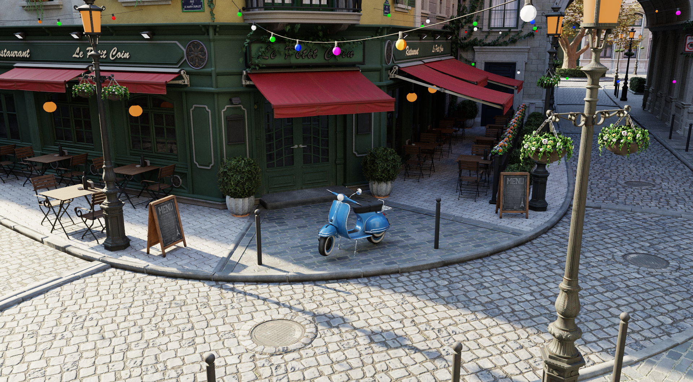
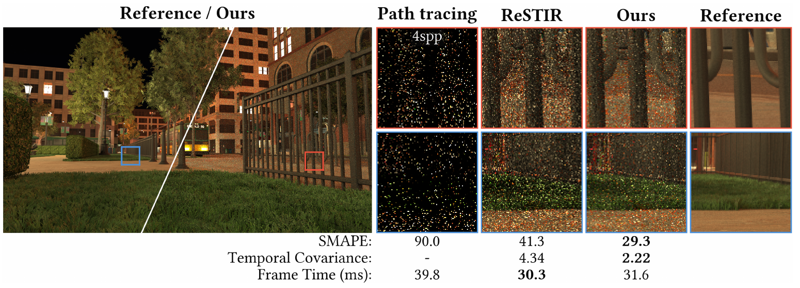
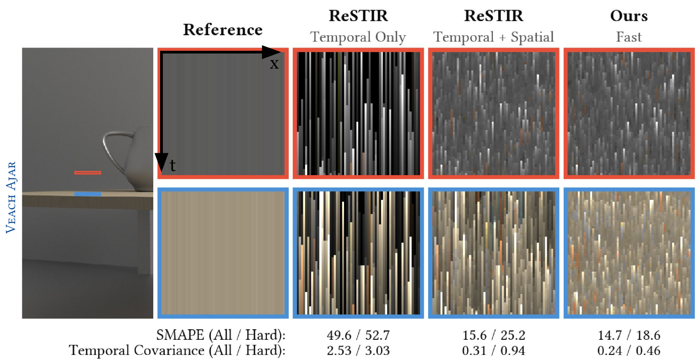

<!-- _class: cover -->
<!-- _paginate: false -->

# ReSTIR Spatial Reuse

Implementation and Evaluation

Group 7 Luoyi Zhang · Zelin Gao

Bistro scene illustration · Amazon Lumberyard / ORCA CC BY 4.0 · cropped to fit

COMP5411 · Fall 2026 · Project proposal

<!--
00:00–00:15 · 15 seconds. Keep the title, group ID, and names visible for at least 3 seconds.

Hello, we are Group Seven, Luoyi Zhang and Zelin Gao. Our project is ReSTIR Spatial Reuse: Implementation and Evaluation. We plan to study how choosing neighboring samples affects real-time rendering quality.

Visual source: Amazon Lumberyard Bistro, ORCA (2017), https://developer.nvidia.com/orca/amazon-lumberyard-bistro. CC BY 4.0. This is a source illustration, not a project render.
-->

---

## ReSTIR reuses light samples

Across neighboring pixels and previous frames

Junkins et al., 2026, Fig. 1 · CC BY 4.0 · “Ours” means the paper authors’ method

<strong>Our question:</strong> Which neighbors provide useful samples?

<!--
00:15–00:45 · 30 seconds.

Rendering a scene with many lights is expensive because each pixel can test only a few samples per frame. ReSTIR keeps a representative light sample with weights, then reuses samples across pixels and frames. But nearby pixels can have different materials, visibility, or lighting. This published comparison illustrates the effect of neighbor selection. These are the authors' results; our project asks when better spatial reuse helps under the same rendering budget.

Sources: Bitterli et al. (2020), https://research.nvidia.com/labs/rtr/publication/bitterli2020spatiotemporal/; Junkins et al. (2026), https://doi.org/10.1145/3820024, Figure 1. Figure rendered from the paper with margins/caption removed; comparison labels and measurements preserved. Copyright the authors, CC BY 4.0. No performance result is claimed for our implementation.
-->

---

## Three methods on one shared baseline

| Method | What we will implement or adapt |
| :--- | :--- |
| **ReSTIR DI** · 2020 | Reservoir sampling, temporal reuse, and spatial reuse |
| **PDF Similarity** · 2023 | Estimate sampling distributions; reject unsuitable reuse |
| **CGNS** · 2026 | Score compatibility; sample neighbors with those weights |

Compare each extension separately against ReSTIR DI

Shared direct lighting, scenes, and rendering budget

<!--
00:45–01:20 · 35 seconds.

We selected three works with increasing sophistication. The original ReSTIR DI provides our baseline. PDF Similarity estimates sampling distributions and rejects spatial reuse when those distributions differ too much. Compatibility-Guided Neighbor Selection, or CGNS, scores candidate neighbors and samples them according to compatibility. We will compare each extension separately against the same DI baseline. Combining both extensions is optional, so the main project stays focused. These are planned reproductions, not a claim that we have already implemented them.

Sources: Bitterli et al. (2020), DOI 10.1145/3386569.3392481; Tokuyoshi (2023), DOI 10.1145/3585501; Junkins et al. (2026), DOI 10.1145/3820024. Full entries: ../../references.bib. PDF Similarity includes temporal safeguards; CGNS transfer from the authors' path tracer to DI must be validated.
-->

---

## Implementation and technical challenges

<h3>Existing renderer</h3>

RTXDI preferred Scene loading, materials, ray tracing, display

<h3>Our contribution</h3>

Core algorithm implementations or ports, diagnostic controls, and repeatable comparisons

<h3>Correct weights</h3>

Reuse must preserve the intended lighting estimate

<h3>Reliable adaptation</h3>

Validate PDF estimates, temporal safeguards, and CGNS in DI

<h3>Fair timing</h3>

Include neighbor-selection overhead

Falcor author code is a reference; we maintain one primary backend

<!--
01:20–01:55 · 35 seconds.

We will reuse an existing renderer for scene loading, materials, ray tracing, and display. RTXDI is our preferred backend, with Falcor author code as a reference. Our work is implementing or adapting the selected algorithms and building diagnostic and evaluation tools. The hardest parts are getting reservoir weights correct, making distribution estimates reliable during motion, and validating CGNS in direct lighting. We must also include the extra selection cost when comparing performance. We will document upstream code and our changes.

Sources: project proposal and scope; NVIDIA RTXDI, https://github.com/NVIDIA-RTX/RTXDI; CGNS author code, https://github.com/orion-junkins/ReSTIR-CGNS. Backend and exact revision remain provisional until the feasibility check.
-->

---

## Quality, cost, and behavior over time

Published temporal-correlation illustration Junkins et al., 2026, Fig. 5 · CC BY 4.0 Each row is a frame; vertical streaks show correlation “Ours” refers to the authors’ method

<h3>Shared test scenes</h3>

Cornell Box · Bistro · Arcade

<h3>Matched-time comparisons</h3>

HDR error against a converged reference; GPU frame time

<h3>Static views + camera motion</h3>

Independent seeds; reuse and neighbor-count ablations

Evaluate before denoising or tone mapping; scene imports remain to be validated

<!--
01:55–02:30 · 35 seconds.

Our initial scene shortlist is Cornell Box, Bistro, and Arcade, starting with the simplest case. We will compare linear HDR output against converged direct-lighting references, measure GPU frame time, and use independent random seeds. Static views test image error; short camera paths test behavior over time. The published figure illustrates why one screenshot is insufficient: vertical streaks reveal persistent errors. We will also disable reuse stages and vary neighbor count to understand which components cause differences.

Sources: project scenes/README.md and experiments/protocol.md; assets https://github.com/NVIDIA-RTX/RTXDI-Assets. Illustration: Junkins et al. (2026), DOI 10.1145/3820024, Figure 5, Veach Ajar scene. The pictured author experiment is not our shortlisted scene suite or our own result. Cropped from PDF to preserve the complete figure, without its caption. CC BY 4.0. Our temporal metric definitions will be fixed before experiments.
-->

---

<!-- _class: schedule -->

## A provisional ten-week plan

| Weeks | Main milestone |
| :--- | :--- |
| **1–2** | Proposal, backend build, and feasibility check |
| **3–5** | ReSTIR DI baseline and PDF Similarity |
| **6–8** | CGNS integration, diagnostics, and demo |
| **9–10** | Evaluation, report, and reproduction check |

Check feasibility early; reduce optional experiments if time becomes tight

<!--
02:30–02:55 · 25 seconds.

The plan spans ten provisional weeks. We will first confirm that the backend builds and that the extensions fit. Then we develop the baseline and PDF Similarity, followed by CGNS and integration. The final weeks are reserved for experiments and writing. We will split implementation and evaluation work, review each other's code, and reduce optional experiments if necessary.

Source: docs/roadmap.md. Week numbers are planning assumptions, not confirmed course milestones. Detailed task status lives in https://github.com/users/TheLogarhythm/projects/1.
-->

---

<!-- _class: closing -->

## A reusable starting point for ReSTIR research

<strong>Three selectable methods</strong> on one documented rendering pipeline

<strong>Repeatable comparisons</strong> with evidence of strengths and limitations

Code, configurations, and report <a href="https://github.com/TheLogarhythm/restir-lab">github.com/TheLogarhythm/restir-lab</a>

<!--
02:55–03:15 · 20 seconds.

Our deliverable is three selectable methods on one documented pipeline, together with repeatable comparisons and a report explaining strengths and limitations. Beyond the course, this repository should help us identify concrete research questions from measured failure cases. We are aiming for a reliable foundation, rather than promising a new algorithm. Thank you.

Source: project proposal and scope. These are planned deliverables; implementation and experiments have not yet begun.
-->
