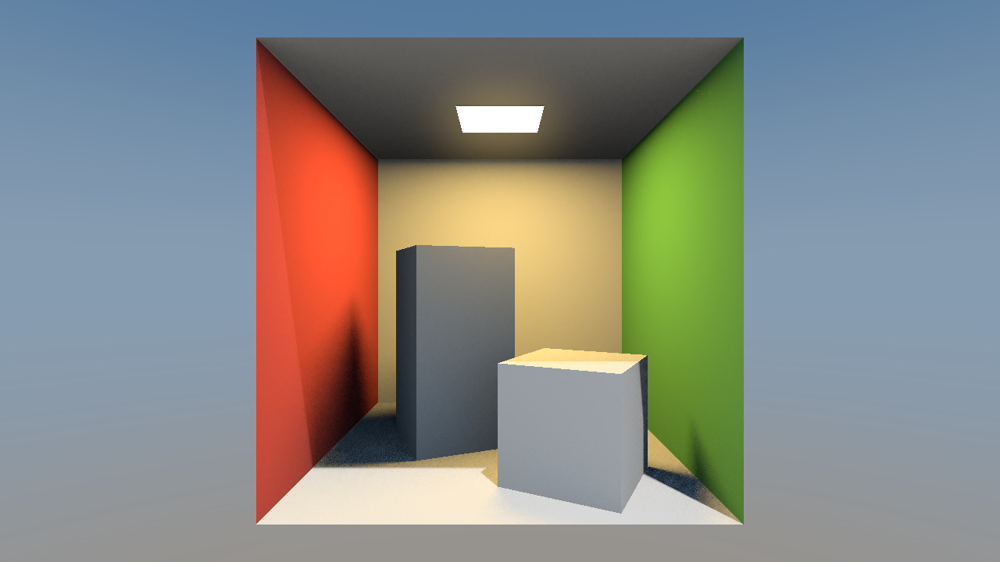
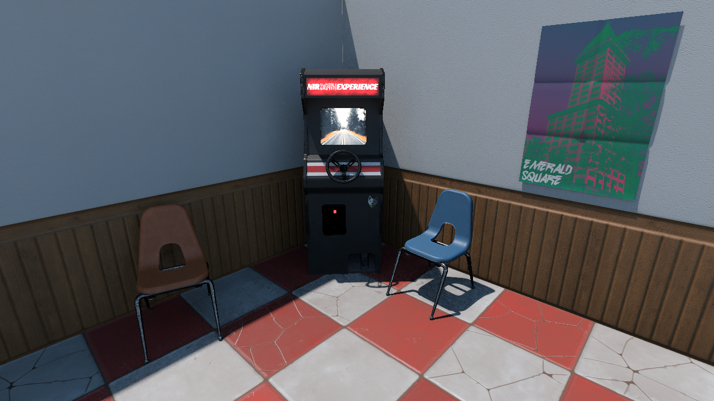

<!-- _class: cover -->
<!-- _paginate: false -->

# ReSTIR Spatial Reuse

Implementation and Evaluation

Group 7 · Luoyi Zhang · Zelin Gao

<strong>ReSTIR</strong> is a sampling technique for real-time rendering. It reuses useful light samples across <strong>nearby pixels</strong> and <strong>previous frames</strong> to reduce noise with a small sampling budget.

Reservoir-based Spatiotemporal Importance Resampling

COMP5411 · Fall 2026 · Project proposal

<!--
00:00–00:25 · rehearsal target

We're Group Seven, Luoyi Zhang and Zelin Gao. Our project studies spatial reuse in ReSTIR.

ReSTIR is a sampling technique for real-time rendering. It reuses useful light samples across nearby pixels and previous frames, reducing noise when only a few samples fit within the rendering budget.

Sources: Bitterli et al. (2020), https://research.nvidia.com/labs/rtr/publication/bitterli2020spatiotemporal/; Junkins et al. (2026), https://research.nvidia.com/labs/rtr/publication/junkins2026compatibility/. The explanation focuses on direct lighting, the transport target of this project.
-->

---

## Spatial reuse across different surfaces

<ul>
<li>Each pixel stores a selected light sample and weight information in a small <strong>reservoir</strong>.</li>
<li>Spatial reuse combines nearby reservoirs, evaluating their samples at the receiving pixel.</li>
<li>Neighbors can have different materials, surface directions, or visibility. Their samples may then be poor choices.</li>
</ul>

Neighbor selection affects both image noise and its persistence over time.

Junkins et al., 2026, Fig. 1 · CC BY 4.0 Published results; “Ours” denotes the authors’ CGNS method.

<!--
00:25–00:56 · rehearsal target

Each pixel stores a light sample and weight information in a small reservoir. Spatial reuse combines neighboring reservoirs, reevaluating samples at the receiving pixel.

However, neighbors can have different materials, surface directions, or visibility, making their samples less useful. This published example shows that neighbor selection affects both image noise and its persistence over time.

Sources: Bitterli et al. (2020), DOI 10.1145/3386569.3392481. Figure: Junkins, Kettunen, Lin, Ramamoorthi and Wyman (2026), https://doi.org/10.1145/3820024, Fig. 1. All original comparison labels and measurements retained; margins and caption removed. CC BY 4.0. These are author results, not this project's results.
-->

---

## Three methods for spatial reuse

A shared direct-lighting baseline, with two separate changes to neighbor reuse.

<table>
<thead><tr><th>Work</th><th>How it handles neighboring samples</th></tr></thead>
<tbody>
<tr><td>ReSTIR DI <small>Bitterli et al., 2020 · baseline</small></td><td>Reuse nearby reservoirs with standard geometric checks.</td></tr>
<tr><td>PDF Similarity <small>Tokuyoshi, 2023 · improvement</small></td><td><strong>Reject</strong> reuse when estimated target distributions differ.</td></tr>
<tr><td>CGNS <small>Junkins et al., 2026 · recent work</small></td><td><strong>Select</strong> neighbors randomly, weighted by geometric compatibility.</td></tr>
</tbody>
</table>

Compare each extension against the same baseline, with consistent scenes and transport settings.

<!--
00:56–01:33 · rehearsal target

We will compare three methods in one direct-lighting pipeline.

ReSTIR DI is our baseline, reusing nearby reservoirs with standard geometric checks. PDF Similarity rejects reuse when the estimated target sampling distributions are too different.

CGNS instead changes neighbor selection. It scores geometric compatibility and samples neighbors using those scores as weights.

We will test each extension separately against the baseline, keeping scenes, lighting, and other sampling settings consistent.

Sources: Bitterli et al. (2020), DOI 10.1145/3386569.3392481; Tokuyoshi (2023), DOI 10.1145/3585501; Junkins et al. (2026), DOI 10.1145/3820024. Full entries: writing/references.bib. “PDF” means probability density function. PDF Similarity requires distribution estimation and temporal safeguards. CGNS transfer from the authors' path tracer to the shared DI pipeline remains a validation task.
-->

---

<!-- _class: implementation -->

## Implementation and correctness

Extend RTXDI’s sampling passes.

<ul>
<li><strong>Baseline:</strong> check sample weights, visibility, and reservoir normalization against a high-sample direct-lighting reference.</li>
<li><strong>PDF Similarity:</strong> estimate distributions reliably and handle invalid history when motion reveals new surfaces.</li>
<li><strong>CGNS:</strong> adapt compatibility scoring and weighted selection to DI, verifying the estimator assumptions.</li>
</ul>

Reuse the renderer infrastructure to keep the two-person workload manageable.

<!--
01:33–02:06 · rehearsal target

We will extend RTXDI's sampling passes.

First, we must check sample weights, visibility, and reservoir normalization against a high-sample direct-lighting reference. PDF Similarity needs reliable distribution estimates, including when motion reveals new surfaces. For CGNS, we must verify that its scoring and weighted selection remain valid for direct lighting.

Reusing the renderer infrastructure keeps the workload manageable for two people.

Sources: Project docs/scope.md and writing/course/proposal/main.tex. RTXDI https://github.com/NVIDIA-RTX/RTXDI; CGNS author code https://github.com/orion-junkins/ReSTIR-CGNS. These are planned algorithm and correctness tasks. Official-code environment verification does not establish a paper reproduction.
-->

---

<!-- _class: evaluation -->

## Scenes and evaluation

<h3>Cornell Box</h3>
Controlled geometry and shadows

<h3>Bistro</h3>
Complex geometry and lighting

<h3>Arcade</h3>
Material changes and local emitters

<ul>
<li>Compare raw HDR error and temporal behavior at <strong>matched GPU time</strong>.</li>
<li>Use static views and short camera moves; vary seeds, reuse modes, and neighbor count.</li>
</ul>

Scene illustrations, not comparison results. Cornell Box / Arcade: official RTXDI previews, MIT assets. Bistro: Amazon Lumberyard / ORCA, CC BY 4.0. Different preview settings; see sources.

<!--
02:06–02:38 · rehearsal target

Cornell Box provides controlled geometry and shadows. Bistro adds complex geometry and lighting. Arcade introduces material changes and local emitters.

We will compare raw HDR image error and temporal behavior at matched GPU time. Static views and short camera moves test steady images and changing visibility. We will also vary random seeds, reuse modes, and neighbor count.

Sources: Project scenes/README.md and experiments/protocol.md. Cornell Box and Arcade: official RTXDI v3.1.0, commit a6efab966b7c3b272da0461578eb56ac61c7cbff; RTXDI-Assets commit 1da7b749ef0e3fb606ab46dde8e5bfbacd078a02, root MIT notice. Locally rendered for this pitch with DI, accumulation AA, frame index 240, tone mapping and default bloom; no denoiser. These are scene previews, not raw experiment outputs. Bistro: Amazon Lumberyard, ORCA (2017), https://developer.nvidia.com/orca/amazon-lumberyard-bistro, CC BY 4.0. Image cropped to fit. Preview settings are not matched across scenes. Sources and capture recipe: writing/course/slides/sources.md.
-->

---

<!-- _class: schedule -->

## Provisional ten-week plan

<table>
<thead><tr><th>Weeks</th><th>Milestone</th></tr></thead>
<tbody>
<tr><td>1–2</td><td>Environment and integration feasibility</td></tr>
<tr><td>3–5</td><td>Validate the DI baseline; add PDF Similarity</td></tr>
<tr><td>6–8</td><td>Integrate CGNS; check correctness and cost; prepare demo</td></tr>
<tr><td>9–10</td><td>Run comparisons and finish the report</td></tr>
</tbody>
</table>

Shared baseline; split the extensions and review each other’s code. Relative weeks are provisional planning targets.

<!--
02:38–02:58 · rehearsal target

We reserve two weeks for feasibility, three for the baseline and PDF Similarity, and three for CGNS and the demo. The final two weeks cover comparisons and reporting. We'll split the extensions and review each other's code.

Sources: Project docs/roadmap.md. Relative weeks are provisional planning assumptions, not confirmed course deadlines. Existing renderer smoke verification is an initial feasibility step; algorithm work and formal comparisons remain planned.
-->

---

<!-- _class: closing -->

## A foundation for further ReSTIR research

<ul>
<li><strong>Three selectable methods</strong> in one renderer, with documented settings.</li>
<li><strong>Repeatable comparisons</strong> and evidence of where each method helps or struggles.</li>
</ul>

Thank you. <a href="https://github.com/TheLogarhythm/restir-lab">github.com/TheLogarhythm/restir-lab</a>

<!--
02:58–03:10 · rehearsal target

We aim to deliver three selectable methods and repeatable comparisons, leaving documented code and evidence that support further ReSTIR research. Thank you.

Sources: Project scope and proposal. These are intended deliverables, not completed algorithm implementations or measured research results.
-->
